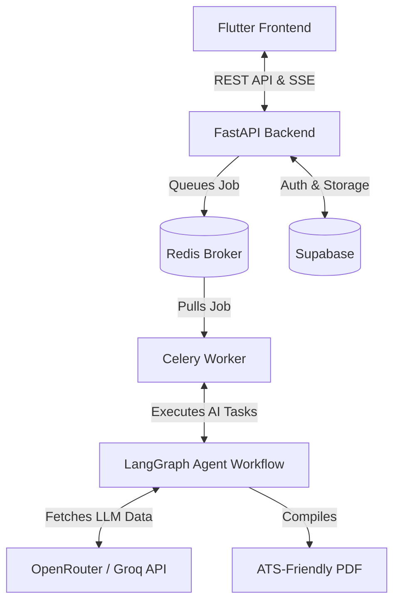
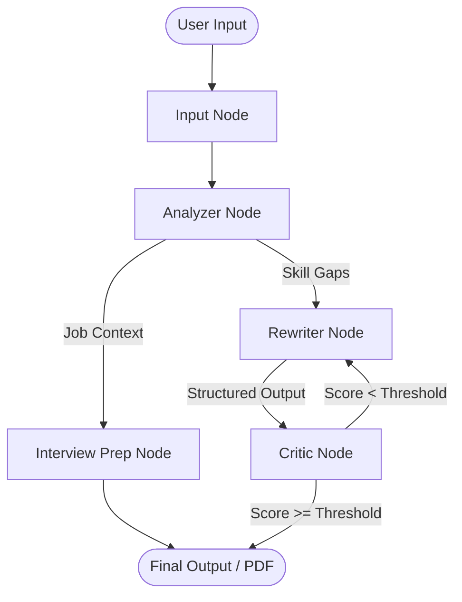

# Resume Agent - AI-Powered Resume Analysis


## Project Overview & Features

Resume Agent is an intelligent, AI-powered tool designed to analyze and optimize resumes against specific job descriptions. By leveraging advanced language models and structured workflows, it evaluates candidate profiles, identifies missing skills, and automatically rewrites resume sections to maximize alignment with target roles.

### 🌟 Core Features
- **Asynchronous Workflow Execution**: Powered by LangGraph for modular, multi-agent AI task orchestration (Analyzer, Critic, Rewriter, Interview).
- **RESTful Backend**: High-performance API built with FastAPI, handling concurrent AI execution and streaming responses.
- **Flutter Front-end**: A responsive, cross-platform UI for seamless resume input and real-time visualization of results.
- **Real-Time Streaming**: Live streaming of rewrite suggestions and workflow states directly to the frontend.
- **PDF Generation**: Automatically generates a beautifully formatted, ATS-friendly PDF resume.

## System Workflow & Architecture

### System Architecture



### LangGraph Workflow Pipeline



1. **Resume Parsing**: The user uploads an existing resume (text or PDF) alongside a target Job Description.
2. **Job Description Matching**: The backend extracts requirements and maps them to the candidate's existing experience.
3. **LangGraph Node Execution**: The input is routed through specialized AI agents:
   - *Analyzer*: Breaks down skill gaps and alignment.
   - *Critic*: Provides critical feedback on formatting, impact, and tone.
   - *Rewriter*: Rewrites bullet points to integrate missing keywords dynamically.
4. **AI Rewrite Suggestion Generation**: The final compiled data is streamed back to the user and rendered into a new PDF.

## Tech Stack

### Backend
- **Python 3.10+**
- **FastAPI**: API routing and asynchronous endpoints.
- **LangGraph & LangChain**: AI workflow orchestration.
- **Celery & Redis**: Background job processing and message brokering.
- **Supabase**: Authentication and storage.

### Frontend
- **Flutter**: Cross-platform UI toolkit.
- **Dart**: Core programming language.
- **Provider**: State management.

## Getting Started & Installation

### Prerequisites
- [Python 3.10+](https://www.python.org/downloads/)
- [Flutter SDK](https://docs.flutter.dev/get-started/install)
- [Redis](https://redis.io/download) (Running on default port `6379`)

### 1. Clone the Repository
```bash
git clone https://github.com/yourusername/resume-agent.git
cd resume-agent
```

### 2. Backend Setup
Set up your environment variables. Copy the example environment file and fill in your API keys (OpenRouter, Groq, etc.):
```bash
cp .env.example .env
```

Install the required Python dependencies:
```bash
python -m venv .venv
source .venv/bin/activate  # On Windows use: .venv\Scripts\activate
pip install -r requirements.txt
```

Start the FastAPI backend server:
```bash
uvicorn app.main:app --reload
```
*(Ensure your local Redis server is running)*

### 3. Frontend Setup
Open a new terminal window, navigate to the frontend directory, and install the dependencies:
```bash
cd frontend
flutter pub get
```

Run the Flutter app:
```bash
flutter run
```

## API Reference & Usage

The backend provides several endpoints for interacting with the AI workflow.

**Create a New Resume Job**
```bash
curl -X POST "http://localhost:8000/jobs" \
     -H "Content-Type: application/json" \
     -d '{
           "resume_text": "Experienced software engineer...",
           "job_description": "Looking for a Python backend developer...",
           "full_name": "John Doe"
         }'
```

**Poll Job Status & SSE Stream**
Connect to the Server-Sent Events (SSE) endpoint to listen to real-time workflow updates:
```bash
curl -N "http://localhost:8000/jobs/{job_id}"
```

## Contributing

Contributions are what make the open source community such an amazing place to learn, inspire, and create. Any contributions you make are **greatly appreciated**.

1. Fork the Project
2. Create your Feature Branch (`git checkout -b feature/AmazingFeature`)
3. Commit your Changes (`git commit -m 'Add some AmazingFeature'`)
4. Push to the Branch (`git push origin feature/AmazingFeature`)
5. Open a Pull Request

## License

Distributed under the MIT License. See `LICENSE` for more information.
